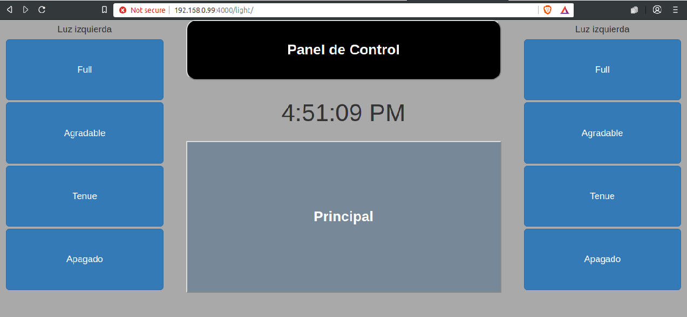
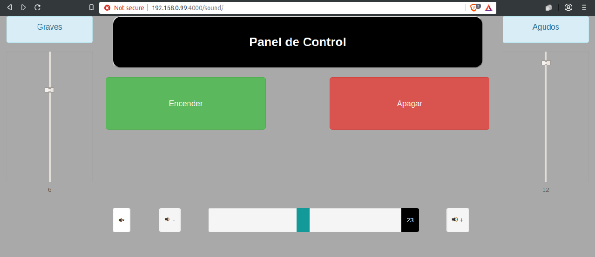
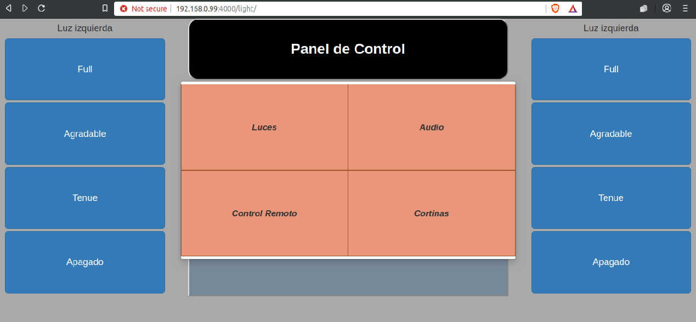

# Node-Habitacion
Se cuenta con:
-Rasperry Pi 2 b+
-Placa con PIC12f629 con etapa de potencia para control de luces
-Placa con preamplificador TDA7449 estereo controlado por I2C y a su salido un modulo amplificador clase d Tpa3116d2
-Placa con biestable para infrarrojo
-Fuente pc 250W
-Placa fuente 12V y 5V
-Pantalla TFT 5inch MPI5008 HDMI touch controlada por SPI

Proyecto consiste en:
-Controlar luces de manera que se puedan ir agregando. Pueden ser dimerizadas de forma indivudual digitalmente por celular o pantalla vía web.
-Controlar equipo de audio (graves, agudos, volumen, balance) con celular o pantalla vía web.
-Controlar Televisor (No smart) por celular o pantalla vía web

Hasta el momento se trae la UI desde el backend.

La app está corriendo en el puerto 4000 del host 192.168.0.99
Se tiene la interfaz  en html de:

Control de luces-  ../light

Control de sonido.  ../sound

menu-

Para controlar el preamplificador se ultiliza la librería de control de GPIO para Raspberry pi y I2C
raspi-i2c I2C
onoff Gpio

Para el control de las luces se utiliza child_process para poder ejecutar desde consola un script Python:
- python2.7 /usr/lib/python2.7/dist-packages/RPi/ejecutarLuz.py al cual se le pasan 2 parametros, el ID de la luz y la intensidad.

